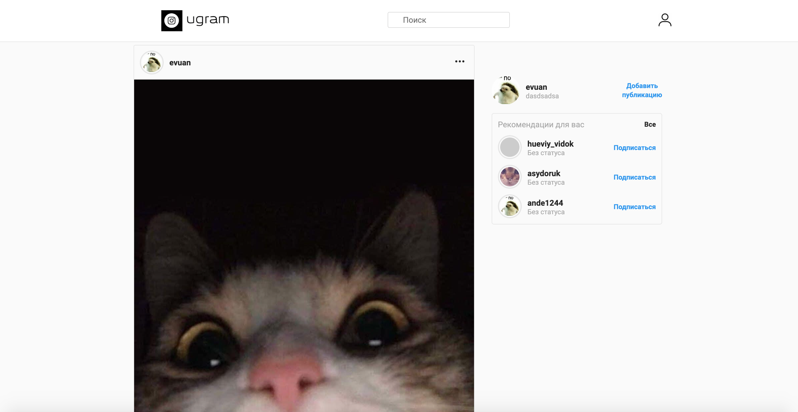
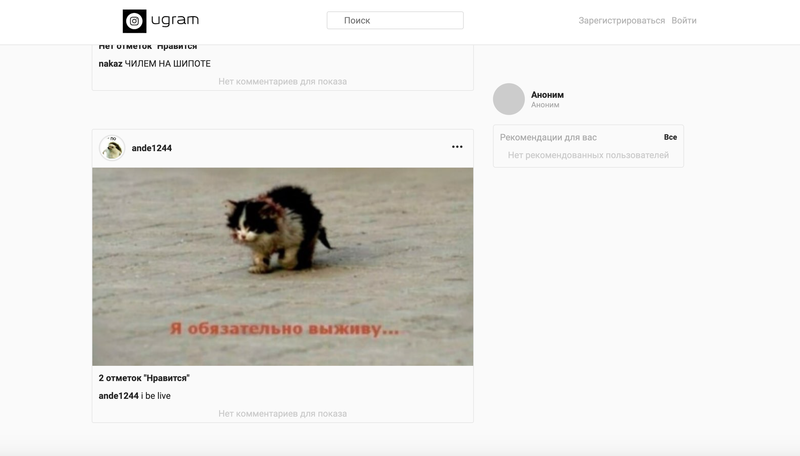
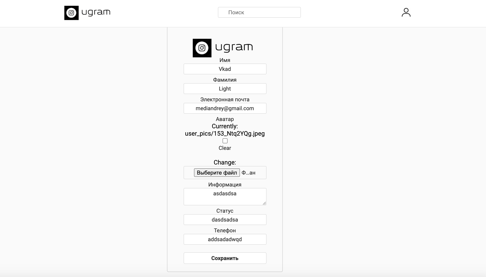
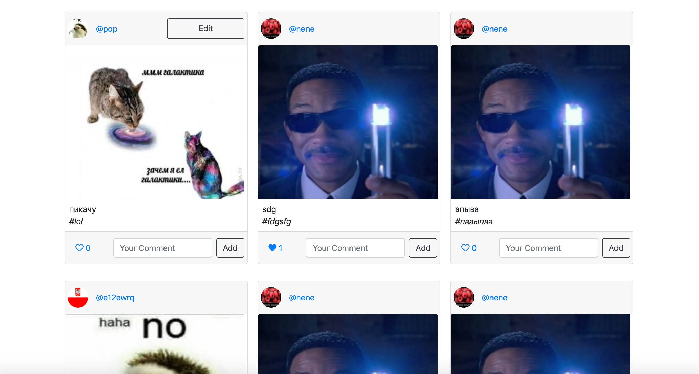
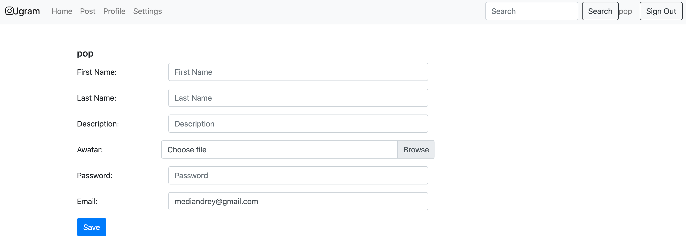
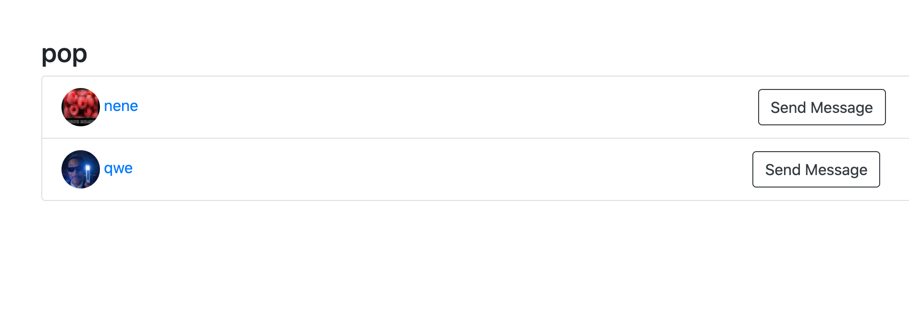

# Ugram
## Django

### How To Setup
1. Clone This Project `git clone`
2. Go to Project Directory `cd ugram && cd python`
3. Create a Virtual Environment `python3 -m venv env`
4. Activate Virtual Environment `source env/bin/activate`
5. Install Requirements Package `pip install -r requirements.txt`
6. Create Migration `python manage.py makemigrations`
7. Migrate Database `python manage.py migrate`
8. Create Super User `python manage.py createsuperuser`
9. Finally Run The Project `python manage.py runserver`

## Java

### Implementation:
Front-End - HTML/CSS/JavaScript/Bootstrap
Back-End - Java 14, Gradle, SQL
Technologies:
Spring Framework, Spring Boot, Spring Security
PostgreSQL

### How To Setup
1. Clone This Project `git clone`
2. Go to Project Directory `cd cashflow && cd java`
3. You have to install PostgreSQL `brew install postgresql`
4. Create user and databases: `psql postgres; CREATE USER root WITH PASSWORD 'insta'; CREATE DATABASE [your login]; CREATE DATABASE cashflow; exit;`
5. apply maven wrapper, if necessary: `mvn -N io.takari:maven:wrapper`
6. Run App: `./gradlew bootRun`
7. open in browser website: `http://localhost:8080/`

### View

